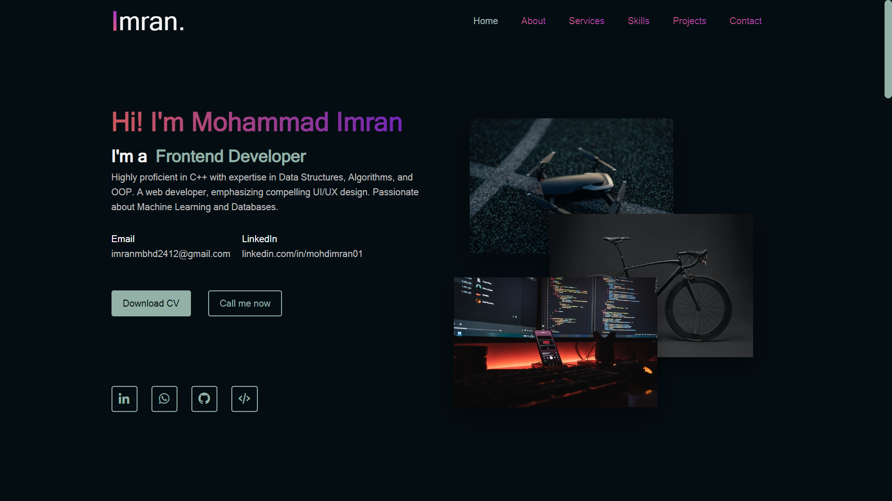

# Welcome to Mohammad Imran's Portfolio 👋

This repository serves as a central hub for my personal portfolio, showcasing my work in **C++ systems, real-time applications, and software engineering projects**.

---

## 🔗 Visit

Explore my portfolio website here:  
👉 https://imran-01.netlify.app

---

## 👨‍💻 About Me

Software Engineer with ~3 years of experience building **high-performance applications using C++**.

Currently working at **Autodesk (Fusion)**, contributing to large-scale systems, debugging complex issues, and improving application reliability.

Previously worked on **flight simulator software (AerX Labs)**, building real-time avionics systems involving multithreading and low-latency communication between software and hardware.

I enjoy working on systems that require **performance, reliability, and deep debugging**.

---

## 🚀 Projects

Most of my projects are focused on:
- C++ desktop applications  
- Real-time data processing  
- Networking (TCP/UDP) systems  
- System-level tools and experiments  

Visit the website’s **Projects section** for details.

---

## 🛠️ Skills

- **Languages:** C++, Python, JavaScript, SQL  
- **Systems:** Multithreading, IPC, Real-time systems  
- **Tools:** CMake, Git, GDB, Valgrind, Wireshark  
- **Databases:** MongoDB, PostgreSQL  
- **Other:** API development, debugging, performance optimization  

---

## 📬 Contact

- 📄 !(Resume)[https://drive.google.com/file/d/1ZN2x7OlE1FSAHaJxwyMex_NLjE38pG1l/view]  
- 📧 !(Email)[iamimran037@gmail.com]  
- 💼 !(LinkedIn)[https://www.linkedin.com/in/mohdimran01]  

---

## 📄 License

This project is licensed under the MIT License.
